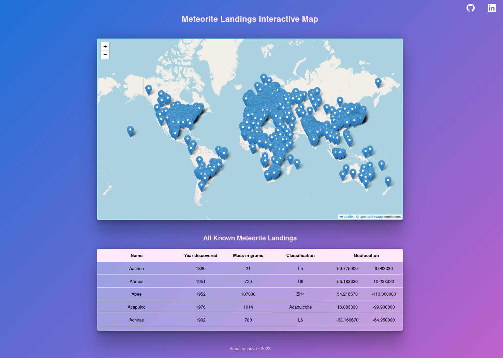

# Meteorite Landings Interactive Map

This data visualization project showcases an interactive map of all known meteorite landings. The data is sourced from [NASA's Meteorite Landings API](https://data.nasa.gov/Space-Science/Meteorite-Landings/gh4g-9sfh).

> Explore the live version [here](https://meteorite-landings-interactive-map.netlify.app/).

## Overview

The map showcases pinpointed locations, accompanied by a table displaying comprehensive landing details. When the user clicks on a location marker on the map, a popup opens, providing detailed information for that specific meteorite landing, including name, year discovered, mass in grams, and classification.

In addition to the map, all known landings are also displayed in a table. Users can effortlessly sort the data by name, year of discovery, and mass in grams by clicking on the respective column headings of the table, enabling efficient exploration and analysis of the meteorite landing dataset.

## Features

-   **Interactive Map:** Explore meteorite landing locations on an interactive map.
-   **Detailed Popup:** Click on map markers to view detailed information about individual meteorite landings.
-   **Sortable Table:** Easily sort data by name, year of discovery, and mass in grams in the table view.
-   **Loading Skeleton:** Enhance user experience with loading skeletons during data fetching.

## Tech Stack

The project is built using the following technologies:

-   React
-   CSS
-   Axios
-   [React Leaflet](https://react-leaflet.js.org/) - a free library for rendering leaflet maps in React. For more information, check out the [getting started guide](https://react-leaflet.js.org/docs/start-installation) or watch this [tutorial demo](https://www.youtube.com/watch?v=290VgjkLong) to get up and running quickly.
